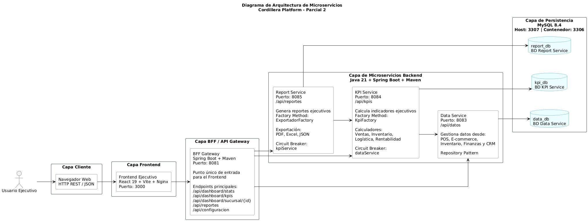
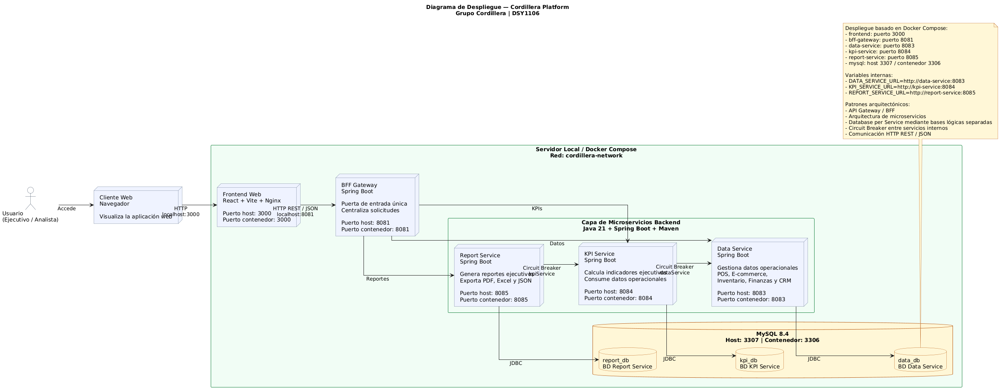

# Cordillera Platform — Plataforma de Microservicios para Monitoreo Ejecutivo

## 1. Información del proyecto

| Campo               | Detalle                                     |
| ------------------- | ------------------------------------------- |
| Proyecto            | Cordillera Platform                         |
| Empresa caso        | Grupo Cordillera                            |
| Asignatura          | Desarrollo Full Stack III — DSY1106         |
| Sección             | 001D                                        |
| Institución         | Duoc UC                                     |
| Tipo de entrega     | Parcial 2                                   |
| Tipo de trabajo     | Grupal                                      |
| Arquitectura        | Microservicios con BFF / API Gateway        |
| Frontend            | React + Vite + Nginx                        |
| Backend             | Java 21, Spring Boot 4.0.6, Maven           |
| Persistencia        | MySQL 8.4 con base lógica por microservicio |
| Comunicación        | HTTP REST / JSON                            |
| Tolerancia a fallos | Resilience4j Circuit Breaker                |
| Pruebas             | JUnit 5, Mockito, MockMvc, JaCoCo           |

---

## 2. Integrantes del equipo

| Integrante      | Responsabilidad principal                                                                                                                                          |
| --------------- | ------------------------------------------------------------------------------------------------------------------------------------------------------------------ |
| Ignacio Valeria | Frontend React + Report Service. Implementación de interfaz ejecutiva, generación/exportación de reportes, documentación técnica, diagramas y apoyo en evidencias. |
| Benjamín Palma  | BFF Gateway + KPI Service. Implementación del punto de entrada central, orquestación de datos para dashboard y cálculo de indicadores ejecutivos.                  |
| Benjamín Flores | Data Service. Implementación del servicio de datos operacionales, persistencia y endpoints para información consolidada desde sistemas origen.                     |

---

## 3. Descripción general

Cordillera Platform es una solución basada en microservicios para la empresa retail **Grupo Cordillera**, cuyo problema principal es la dispersión de información en distintos sistemas internos:

```text
- POS
- E-commerce
- Inventario
- Finanzas
- CRM
```

La plataforma permite centralizar datos operacionales, calcular KPIs ejecutivos y generar reportes para apoyar la toma de decisiones.
El flujo principal del sistema es:

```text
Usuario → Frontend → BFF Gateway → Microservicios → MySQL
```

La solución aplica arquitectura de microservicios, patrón BFF / API Gateway, Database per Service, Repository Pattern, Factory Method y Circuit Breaker con Resilience4j.

---

## 4. Objetivo del proyecto

Desarrollar una plataforma fullstack basada en microservicios que permita:

```text
1. Consolidar datos operacionales provenientes de distintos sistemas.
2. Calcular indicadores ejecutivos para apoyar la toma de decisiones.
3. Generar reportes ejecutivos exportables.
4. Exponer una interfaz frontend centralizada para el usuario.
5. Aplicar patrones de diseño y arquitectura solicitados en la rúbrica.
6. Evidenciar buenas prácticas de desarrollo, pruebas y versionamiento Git Flow.
```

---

## 5. Arquitectura general

### 5.1 Diagrama de arquitectura de microservicios



### 5.2 Diagrama de despliegue



### 5.3 Diagramas de clases

| Servicio       | Diagrama                                   |
| -------------- | ------------------------------------------ |
| BFF Gateway    | `docs/diagramas/bff-service-clases.png`    |
| Data Service   | `docs/diagramas/data-service-clases.png`   |
| KPI Service    | `docs/diagramas/kpi-service-clases.png`    |
| Report Service | `docs/diagramas/report-service-clases.png` |

### 5.4 Diagramas de casos de uso

| Servicio       | Diagrama                                      |
| -------------- | --------------------------------------------- |
| BFF Gateway    | `docs/diagramas/bff-service-casos-uso.png`    |
| Data Service   | `docs/diagramas/data-service-casos-uso.png`   |
| KPI Service    | `docs/diagramas/kpi-service-casos-uso.png`    |
| Report Service | `docs/diagramas/report-service-casos-uso.png` |

---

## 6. Componentes del sistema

| Componente     | Carpeta          |    Puerto | Base de datos                    | Responsabilidad                                                                                 |
| -------------- | ---------------- | --------: | -------------------------------- | ----------------------------------------------------------------------------------------------- |
| Frontend       | `frontend`       |      3000 | No aplica                        | Interfaz ejecutiva web para consultar dashboard, KPIs, reportes, alertas y estado de servicios. |
| BFF Gateway    | `bff-gateway`    |      8081 | No aplica                        | Punto único de entrada para el frontend. Centraliza y orquesta solicitudes.                     |
| Data Service   | `data-service`   |      8083 | `data_db`                        | Gestiona datos operacionales desde POS, E-commerce, Inventario, Finanzas y CRM.                 |
| KPI Service    | `kpi-service`    |      8084 | `kpi_db`                         | Calcula indicadores ejecutivos usando `KpiFactory` y calculadores especializados.               |
| Report Service | `report-service` |      8085 | `report_db`                      | Genera, consulta y exporta reportes ejecutivos en PDF, Excel y JSON.                            |
| MySQL          | `mysql`          | 3307:3306 | `data_db`, `kpi_db`, `report_db` | Motor de persistencia relacional utilizado por los microservicios.                              |

---

## 7. Tecnologías utilizadas

| Categoría               | Tecnología                   |
| ----------------------- | ---------------------------- |
| Lenguaje backend        | Java 21                      |
| Framework backend       | Spring Boot 4.0.6            |
| Gestión de dependencias | Maven                        |
| Persistencia            | Spring Data JPA / Hibernate  |
| Base de datos           | MySQL 8.4                    |
| Frontend                | React + Vite                 |
| Servidor frontend       | Nginx                        |
| Comunicación            | REST / JSON                  |
| Tolerancia a fallos     | Resilience4j Circuit Breaker |
| Pruebas unitarias       | JUnit 5                      |
| Mocks                   | Mockito                      |
| Pruebas controller      | MockMvc                      |
| Cobertura               | JaCoCo                       |
| Contenedores            | Docker                       |
| Orquestación local      | Docker Compose               |
| Control de versiones    | Git + GitHub                 |

---

## 8. Patrones implementados

### 8.1 API Gateway / BFF

Implementado en `bff-gateway`.

El BFF actúa como punto único de entrada para el frontend, centralizando solicitudes hacia Data Service, KPI Service y Report Service.

```text
Frontend → BFF Gateway → Microservicios
```

Endpoints principales:

```text
GET /api/dashboard/stats
GET /api/dashboard/kpis
GET /api/dashboard/sucursal/{id}
GET /api/reportes
GET /api/configuracion
```

---

### 8.2 Repository Pattern

Implementado en los microservicios con Spring Data JPA.

| Servicio       | Repository          |
| -------------- | ------------------- |
| Data Service   | `DatoRepository`    |
| KPI Service    | `KpiRepository`     |
| Report Service | `ReporteRepository` |

Ejemplos:

```java
findBySistemaOrigen(String sistemaOrigen)
findBySucursalId(Long sucursalId)
findByCategoria(String categoria)
findByArea(String area)
```

---

### 8.3 Factory Method

Implementado en KPI Service y Report Service.

#### KPI Service

```text
KpiFactory
├── VentasCalculator
├── InventarioCalculator
├── LogisticaCalculator
└── RentabilidadCalculator
```

Permite seleccionar el cálculo correspondiente según la categoría del KPI.

#### Report Service

```text
ExportadorFactory
├── PdfExportador
├── ExcelExportador
└── JsonExportador
```

Permite seleccionar el exportador adecuado según el formato solicitado.

---

### 8.4 Circuit Breaker

Implementado con Resilience4j.

| Origen         | Destino      | Circuit Breaker |
| -------------- | ------------ | --------------- |
| KPI Service    | Data Service | `dataService`   |
| Report Service | KPI Service  | `kpiService`    |

El objetivo es evitar que una falla en un servicio interno detenga toda la plataforma.

Estados principales:

```text
CLOSED → OPEN → HALF-OPEN
```

---

### 8.5 Database per Service

Cada microservicio posee su propia base lógica dentro de MySQL.

```text
data-service   → data_db
kpi-service    → kpi_db
report-service → report_db
```

Esto reduce el acoplamiento entre servicios y permite separar responsabilidades de persistencia.

---

## 9. Estructura general del repositorio

```text
cordillera-platform/
│
├── frontend/
│   ├── src/
│   ├── public/
│   ├── package.json
│   ├── vite.config.js
│   └── Dockerfile
│
├── bff-gateway/
│   ├── src/
│   ├── pom.xml
│   └── Dockerfile
│
├── data-service/
│   ├── src/
│   ├── pom.xml
│   └── Dockerfile
│
├── kpi-service/
│   ├── src/
│   ├── pom.xml
│   └── Dockerfile
│
├── report-service/
│   ├── src/
│   ├── pom.xml
│   └── Dockerfile
│
├── docs/
│   ├── diagramas/
│   ├── evidencias/
│   ├── git-flow/
│   └── pruebas/
│
├── docker-compose.yml
└── README.md
```

---

## 10. Estructura interna de los microservicios backend

Cada microservicio Spring Boot mantiene una estructura por capas:

```text
src/
├── main/
│   ├── java/
│   │   └── cl/cordillera/...
│   │       ├── controller/
│   │       ├── service/
│   │       ├── repository/
│   │       ├── model/
│   │       ├── dto/
│   │       ├── factory/
│   │       ├── config/
│   │       └── exception/
│   │
│   └── resources/
│       └── application.properties
│
└── test/
    └── java/
```

Flujo interno aplicado:

```text
Controller → Service → Repository → Model
```

---

## 11. Requisitos previos

Antes de ejecutar el proyecto, se debe contar con:

| Herramienta    | Uso                                   |
| -------------- | ------------------------------------- |
| Java JDK 21    | Ejecutar microservicios Spring Boot   |
| Maven 3.9+     | Compilar, probar y empaquetar backend |
| Node.js 20+    | Ejecutar frontend en entorno local    |
| npm            | Gestión de dependencias frontend      |
| Docker         | Crear y ejecutar contenedores         |
| Docker Compose | Levantar la plataforma completa       |
| Git            | Control de versiones                  |
| Postman        | Pruebas manuales de endpoints         |

Verificar instalaciones:

```powershell
java -version
mvn -version
node -v
npm -v
docker --version
docker compose version
git --version
```

---

## 12. Clonar el repositorio

```powershell
git clone https://github.com/Nachovn12/cordillera-platform-parcial-2.git
cd cordillera-platform-parcial-2
git status
```

Resultado esperado:

```text
On branch main
nothing to commit, working tree clean
```

Si se trabaja desde integración:

```powershell
git checkout develop
git pull origin develop
```

---

## 13. Ejecución recomendada con Docker Compose

La forma recomendada de ejecutar el proyecto completo es usando Docker Compose.

### 13.1 Levantar todos los servicios

Desde la raíz del proyecto:

```powershell
docker compose up --build
```

Servicios levantados:

```text
frontend       → http://localhost:3000
bff-gateway    → http://localhost:8081
data-service   → http://localhost:8083
kpi-service    → http://localhost:8084
report-service → http://localhost:8085
mysql          → localhost:3307
```

### 13.2 Levantar en segundo plano

```powershell
docker compose up --build -d
```

### 13.3 Ver contenedores activos

```powershell
docker compose ps
```

### 13.4 Ver logs

```powershell
docker compose logs -f
```

Ver logs de un servicio específico:

```powershell
docker compose logs -f report-service
```

### 13.5 Detener la plataforma

```powershell
docker compose down
```

### 13.6 Detener y eliminar volúmenes

Usar solo si se desea reiniciar completamente las bases de datos:

```powershell
docker compose down -v
```

---

## 14. Bases de datos MySQL

El contenedor MySQL utiliza:

```text
Imagen: mysql:8.4
Host: 3307
Contenedor: 3306
```

Bases lógicas utilizadas:

```text
data_db
kpi_db
report_db
```

Relación por microservicio:

| Microservicio  | Base de datos |
| -------------- | ------------- |
| Data Service   | `data_db`     |
| KPI Service    | `kpi_db`      |
| Report Service | `report_db`   |

---

## 15. Variables internas de servicios

Dentro de Docker Compose, los servicios se comunican usando el nombre del contenedor.

```text
DATA_SERVICE_URL=http://data-service:8083
KPI_SERVICE_URL=http://kpi-service:8084
REPORT_SERVICE_URL=http://report-service:8085
```

El frontend consume el BFF mediante:

```text
VITE_API_BASE_URL=http://localhost:8081
```

---

## 16. Ejecución manual sin Docker

También es posible ejecutar cada componente de forma independiente.

Se recomienda abrir una terminal por cada microservicio que se desee levantar.
En los equipos del instituto, la forma recomendada es usar el Maven Wrapper incluido en cada servicio:

### 16.1 Ejecutar Data Service

```powershell
cd .\data-service\
.\mvnw.cmd spring-boot:run
```

### 16.2 Ejecutar KPI Service

```powershell
cd .\kpi-service\
.\mvnw.cmd spring-boot:run
```

### 16.3 Ejecutar Report Service

```powershell
cd .\report-service\
.\mvnw.cmd spring-boot:run
```

### 16.4 Ejecutar BFF Gateway

```powershell
cd .\bff-gateway\
.\mvnw.cmd spring-boot:run
```

### 16.5 Ejecutar Frontend

```powershell
cd frontend
npm install
npm run dev
```

---

## 17. Orden recomendado de ejecución manual

Si no se utiliza Docker Compose, se recomienda levantar los servicios en este orden:

```text
1. MySQL.
2. Data Service.
3. KPI Service.
4. Report Service.
5. BFF Gateway.
6. Frontend.
```

Esto evita errores de conexión, ya que KPI Service depende de Data Service y Report Service depende de KPI Service.

---

## 18. Endpoints principales

### 18.1 BFF Gateway

Base URL:

```text
http://localhost:8081
```

| Método | Endpoint                       | Descripción                               |
| ------ | ------------------------------ | ----------------------------------------- |
| GET    | `/api/dashboard/stats`         | Obtiene datos consolidados del dashboard. |
| GET    | `/api/dashboard/kpis`          | Obtiene KPIs consolidados.                |
| GET    | `/api/dashboard/sucursal/{id}` | Obtiene datos filtrados por sucursal.     |
| GET    | `/api/reportes`                | Proxy o consulta de reportes.             |
| GET    | `/api/configuracion`           | Consulta configuración general.           |

---

### 18.2 Data Service

Base URL:

```text
http://localhost:8083
```

| Método | Endpoint                      | Descripción                          |
| ------ | ----------------------------- | ------------------------------------ |
| GET    | `/api/datos`                  | Lista todos los datos operacionales. |
| POST   | `/api/datos`                  | Registra un nuevo dato operacional.  |
| GET    | `/api/datos/{id}`             | Consulta un dato por ID.             |
| PUT    | `/api/datos/{id}`             | Actualiza un dato operacional.       |
| DELETE | `/api/datos/{id}`             | Elimina un dato operacional.         |
| GET    | `/api/datos/sistema/{origen}` | Filtra datos por sistema origen.     |
| GET    | `/api/datos/sucursal/{id}`    | Filtra datos por sucursal.           |

---

### 18.3 KPI Service

Base URL:

```text
http://localhost:8084
```

| Método | Endpoint                    | Descripción                |
| ------ | --------------------------- | -------------------------- |
| GET    | `/api/kpis`                 | Lista todos los KPIs.      |
| POST   | `/api/kpis`                 | Registra un nuevo KPI.     |
| GET    | `/api/kpis/{id}`            | Consulta un KPI por ID.    |
| PUT    | `/api/kpis/{id}`            | Actualiza un KPI.          |
| DELETE | `/api/kpis/{id}`            | Elimina un KPI.            |
| GET    | `/api/kpis/categoria/{cat}` | Filtra KPIs por categoría. |

---

### 18.4 Report Service

Base URL:

```text
http://localhost:8085
```

| Método | Endpoint                                   | Descripción                                |
| ------ | ------------------------------------------ | ------------------------------------------ |
| GET    | `/api/reportes`                            | Lista todos los reportes.                  |
| POST   | `/api/reportes`                            | Crea un reporte.                           |
| GET    | `/api/reportes/{id}`                       | Consulta un reporte por ID.                |
| PUT    | `/api/reportes/{id}`                       | Actualiza un reporte.                      |
| DELETE | `/api/reportes/{id}`                       | Elimina un reporte.                        |
| GET    | `/api/reportes/area/{area}`                | Filtra reportes por área.                  |
| POST   | `/api/reportes/generar`                    | Genera un reporte ejecutivo.               |
| GET    | `/api/reportes/{id}/exportar`              | Exporta un reporte.                        |
| GET    | `/api/reportes/kpis`                       | Consulta KPIs desde KPI Service.           |
| GET    | `/api/reportes/kpis/categoria/{categoria}` | Consulta KPIs por categoría para reportes. |

---

## 19. Ejemplos de prueba con PowerShell

### 19.1 Probar BFF Gateway

```powershell
Invoke-RestMethod http://localhost:8081/api/dashboard/stats
```

### 19.2 Probar Data Service

```powershell
Invoke-RestMethod http://localhost:8083/api/datos
```

### 19.3 Probar KPI Service

```powershell
Invoke-RestMethod http://localhost:8084/api/kpis
```

### 19.4 Probar Report Service

```powershell
Invoke-RestMethod http://localhost:8085/api/reportes
```

---

## 20. Pruebas automatizadas

El proyecto utiliza JUnit 5, Mockito, MockMvc y JaCoCo.

### 20.1 Ejecutar pruebas por microservicio

Desde la raíz del repositorio:

```powershell
mvn -f bff-gateway/pom.xml clean test
mvn -f data-service/pom.xml clean test
mvn -f kpi-service/pom.xml clean test
mvn -f report-service/pom.xml clean test
```

Resultado esperado:

```text
BUILD SUCCESS
```

---

## 21. Cobertura con JaCoCo

La cobertura mínima esperada para la entrega es:

```text
≥ 60%
```

### 21.1 Ejecutar cobertura en Report Service

```powershell
mvn -f report-service/pom.xml clean test jacoco:report
```

Reporte generado:

```text
report-service/target/site/jacoco/index.html
```

### 21.2 Ejecutar package con validación

```powershell
mvn -f report-service/pom.xml clean package
```

---

## 22. Pruebas prioritarias de Report Service

El Report Service es el componente prioritario del equipo para pruebas.

Pruebas esperadas:

```text
- ReportServiceTest con JUnit 5 y Mockito.
- ReportControllerTest con MockMvc.
- Test de fallback para Circuit Breaker hacia KPI Service.
- Validación de exportación PDF, Excel y JSON.
- Cobertura JaCoCo igual o superior al 60%.
```

Clases relevantes:

```text
ReporteController
ReporteService
ReporteRepository
Reporte
ExportadorFactory
Exportador
PdfExportador
ExcelExportador
JsonExportador
KpiClienteService
```

---

## 23. Pruebas manuales con Postman

Para validar con Postman:

```text
1. Levantar la plataforma con Docker Compose.
2. Verificar que todos los contenedores estén activos.
3. Crear una colección Postman.
4. Configurar variables de entorno.
5. Ejecutar endpoints por servicio.
6. Capturar evidencia de respuestas exitosas.
```

Variables sugeridas:

| Variable       | Valor                   |
| -------------- | ----------------------- |
| `frontend_url` | `http://localhost:3000` |
| `bff_url`      | `http://localhost:8081` |
| `data_url`     | `http://localhost:8083` |
| `kpi_url`      | `http://localhost:8084` |
| `report_url`   | `http://localhost:8085` |

---

## 24. Comunicación entre microservicios

| Origen         | Destino        | Propósito                               |
| -------------- | -------------- | --------------------------------------- |
| Frontend       | BFF Gateway    | Consumir datos consolidados para la UI. |
| BFF Gateway    | Data Service   | Obtener datos operacionales.            |
| BFF Gateway    | KPI Service    | Obtener indicadores ejecutivos.         |
| BFF Gateway    | Report Service | Obtener y gestionar reportes.           |
| KPI Service    | Data Service   | Consultar datos para cálculo de KPIs.   |
| Report Service | KPI Service    | Consultar KPIs para generar reportes.   |

---

## 25. Manejo de errores y tolerancia a fallos

El sistema utiliza respuestas HTTP estándar y Circuit Breaker en llamadas internas.

| Código | Significado           | Uso                              |
| -----: | --------------------- | -------------------------------- |
|    200 | OK                    | Consulta exitosa.                |
|    201 | Created               | Recurso creado correctamente.    |
|    204 | No Content            | Operación exitosa sin contenido. |
|    400 | Bad Request           | Datos inválidos.                 |
|    404 | Not Found             | Recurso no encontrado.           |
|    500 | Internal Server Error | Error interno.                   |

Circuit Breaker aplicado en:

```text
KPI Service → Data Service
Report Service → KPI Service
```

---

## 26. Flujo Git utilizado

El proyecto sigue Git Flow simplificado según la rúbrica.

| Rama                        | Propósito                                     |
| --------------------------- | --------------------------------------------- |
| `main`                      | Rama estable de producción / entrega final.   |
| `develop`                   | Rama de integración del equipo.               |
| `feature/nombre-componente` | Desarrollo de funcionalidades por componente. |
| `hotfix/nombre`             | Correcciones urgentes.                        |

Flujo esperado:

```text
feature/* → Pull Request → develop → Pull Request → main
```

Reglas aplicadas:

```text
- Todo cambio entra mediante Pull Request.
- Al menos un integrante revisa el Pull Request.
- Se documentan merges.
- Se mantiene evidencia de ramas.
- Se documenta al menos un conflicto resuelto.
```

---

## 27. Buenas prácticas aplicadas

```text
- Separación por capas: Controller → Service → Repository → Model.
- DTOs para transportar respuestas.
- Repository Pattern con Spring Data JPA.
- Factory Method para KPIs y exportadores.
- Circuit Breaker para tolerancia a fallos.
- Database per Service.
- Docker Compose para ejecución unificada.
- README por componente.
- Pruebas unitarias y de controlador.
- Cobertura con JaCoCo.
- Código versionado con Git Flow.
```

---

## 28. Documentación técnica del proyecto

| Documento                 | Ruta                                                |
| ------------------------- | --------------------------------------------------- |
| Diagrama de arquitectura  | `docs/diagramas/arquitectura-microservicios.png`    |
| Diagrama de despliegue    | `docs/diagramas/despliegue-cordillera-platform.png` |
| Diagramas de clases       | `docs/diagramas/*-clases.png`                       |
| Diagramas de casos de uso | `docs/diagramas/*-casos-uso.png`                    |
| Evidencias de Git Flow    | `docs/git-flow/`                                    |
| Evidencias de pruebas     | `docs/evidencias/`                                  |
| Evidencias JaCoCo         | `docs/pruebas/`                                     |
| Colección Postman         | `docs/postman/`                                     |

---

## 29. Preparación para entrega AVA

Checklist recomendado antes de comprimir:

```text
1. Verificar que el proyecto compile.
2. Ejecutar pruebas unitarias.
3. Validar cobertura JaCoCo.
4. Levantar Docker Compose.
5. Verificar frontend en http://localhost:3000.
6. Verificar BFF Gateway en http://localhost:8081.
7. Probar endpoints principales.
8. Revisar diagramas.
9. Revisar README principal.
10. Revisar README de cada componente.
11. Verificar evidencia Git Flow.
12. Eliminar carpetas innecesarias antes de comprimir.
```

No incluir en el ZIP final:

```text
target/
node_modules/
.idea/
.vscode/
*.log
.env con credenciales reales
```

Sí incluir:

```text
README.md
docker-compose.yml
frontend/
bff-gateway/
data-service/
kpi-service/
report-service/
docs/
pom.xml de cada microservicio
package.json del frontend
```

---

## 30. Comandos útiles antes de entrega

### 30.1 Ver estado Git

```powershell
git status
```

### 30.2 Ver ramas

```powershell
git branch -a
```

### 30.3 Ver últimos commits

```powershell
git log --oneline -10
```

### 30.4 Limpiar carpetas target

```powershell
Get-ChildItem -Path . -Recurse -Directory -Filter target | Remove-Item -Recurse -Force
```

### 30.5 Limpiar node_modules

```powershell
Remove-Item -Recurse -Force frontend/node_modules
```

---

## 31. Comandos rápidos de validación final

### 31.1 Backend

```powershell
mvn -f bff-gateway/pom.xml clean test
mvn -f data-service/pom.xml clean test
mvn -f kpi-service/pom.xml clean test
mvn -f report-service/pom.xml clean test
```

### 31.2 Report Service con JaCoCo

```powershell
mvn -f report-service/pom.xml clean test jacoco:report
```

### 31.3 Frontend

```powershell
cd frontend
npm install
npm run build
```

### 31.4 Docker Compose

```powershell
docker compose up --build
```

---

## 32. Estado esperado de validación

Resultado esperado de backend:

```text
BUILD SUCCESS
```

Resultado esperado de frontend:

```text
vite build completed
```

Resultado esperado de Docker Compose:

```text
frontend       running
bff-gateway    running
data-service   running
kpi-service    running
report-service running
mysql          running
```

Resultado esperado de cobertura:

```text
JaCoCo ≥ 60%
```

---

## 33. Preparación para defensa oral

Puntos clave para explicar:

```text
1. La plataforma resuelve la dispersión de datos del Grupo Cordillera.
2. El BFF Gateway centraliza las solicitudes del Frontend.
3. Data Service gestiona datos operacionales.
4. KPI Service calcula indicadores mediante KpiFactory.
5. Report Service genera y exporta reportes mediante ExportadorFactory.
6. Cada microservicio tiene su propia base lógica.
7. Circuit Breaker evita que una falla detenga toda la plataforma.
8. Docker Compose permite levantar todo el ecosistema localmente.
9. Git Flow permite colaboración ordenada.
10. Las pruebas y JaCoCo evidencian calidad técnica.
```

---

## 34. Conclusión

Cordillera Platform implementa una solución fullstack basada en microservicios para consolidar datos operacionales, calcular KPIs y generar reportes ejecutivos para Grupo Cordillera.

La solución integra un frontend React, un BFF Gateway, tres microservicios Spring Boot, persistencia MySQL, comunicación REST, patrones de diseño y mecanismos de tolerancia a fallos. Además, incorpora pruebas automatizadas, cobertura con JaCoCo, contenedores Docker y documentación técnica alineada con la rúbrica del Parcial 2 de Desarrollo Full Stack III.

El proyecto queda preparado para entrega en AVA y defensa oral individual, evidenciando arquitectura escalable, separación de responsabilidades, uso de patrones, buenas prácticas de desarrollo y control de versiones mediante Git Flow.
