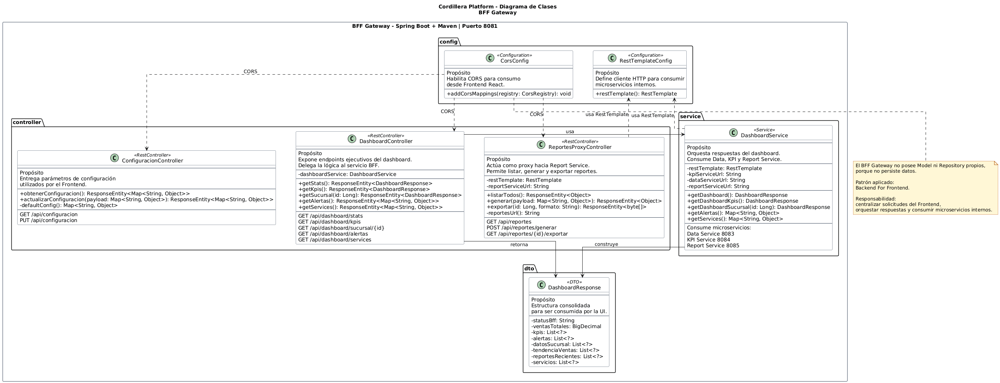
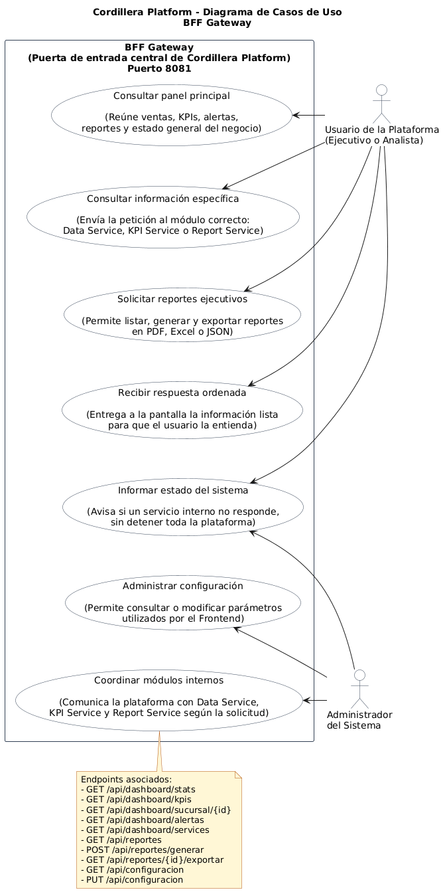

# BFF Gateway - Cordillera Platform

Microservicio **Backend For Frontend** de Cordillera Platform, correspondiente al Parcial 2 de la asignatura **Desarrollo Full Stack III - DSY1106**.

## 1. Descripción

`bff-gateway` actúa como punto único de entrada para el Frontend React. Su responsabilidad es centralizar las solicitudes del usuario ejecutivo, consultar los microservicios internos y entregar respuestas consolidadas para la interfaz.

El frontend no consume directamente `data-service`, `kpi-service` ni `report-service`; consume únicamente este BFF Gateway mediante HTTP REST / JSON.

## 2. Responsable

| Campo                 | Detalle                 |
| --------------------- | ----------------------- |
| Responsable principal | Benjamín Palma          |
| Componente            | BFF Gateway             |
| Rama sugerida         | `feature/bff-gateway`   |
| Puerto local          | `8081`                  |
| Base de datos         | No aplica               |
| URL base local        | `http://localhost:8081` |

## 3. Rol dentro de la arquitectura

```text
Frontend React + Nginx :3000 -> BFF Gateway :8081 -> Data Service / KPI Service / Report Service
```

El BFF centraliza la comunicación entre la interfaz ejecutiva y los microservicios backend.

## 4. Stack utilizado

- Java 21
- Spring Boot 4.0.6
- Maven
- Spring Web
- RestTemplate
- Docker

## 5. Puerto y configuración

```properties
server.port=8081
spring.application.name=bff-gateway

services.data.url=${DATA_SERVICE_URL:http://localhost:8083}
services.kpi.url=${KPI_SERVICE_URL:http://localhost:8084}
services.report.url=${REPORT_SERVICE_URL:http://localhost:8085}
```

> Nota: se usa `8081` porque el puerto `8080` puede estar ocupado en equipos del instituto.

## 6. Microservicios integrados

| Servicio       | URL local               | URL Docker Compose           |
| -------------- | ----------------------- | ---------------------------- |
| Data Service   | `http://localhost:8083` | `http://data-service:8083`   |
| KPI Service    | `http://localhost:8084` | `http://kpi-service:8084`    |
| Report Service | `http://localhost:8085` | `http://report-service:8085` |

## 7. Base de datos

Este microservicio no posee base de datos propia, ya que no persiste información.
Su responsabilidad es orquestar solicitudes y consolidar respuestas para el Frontend.

## 8. Patrones y buenas prácticas aplicadas

| Patrón / práctica     | Aplicación                                                  |
| --------------------- | ----------------------------------------------------------- |
| API Gateway / BFF     | Centraliza solicitudes del Frontend.                        |
| DTO                   | Usa `DashboardResponse` para consolidar respuestas.         |
| Separación por capas  | Controller -> Service / lógica de orquestación.             |
| Respuestas degradadas | Mantiene respuesta controlada si un servicio interno falla. |

## 9. Clases principales

```text
DashboardController
DashboardService
DashboardResponse
ReportesProxyController
ConfiguracionController
CorsConfig
```

## 10. Endpoints principales

| Método | Endpoint                       | Descripción                                      |
| ------ | ------------------------------ | ------------------------------------------------ |
| GET    | `/api/dashboard/stats`         | Obtiene estadísticas consolidadas del dashboard. |
| GET    | `/api/dashboard/kpis`          | Obtiene KPIs desde KPI Service.                  |
| GET    | `/api/dashboard/sucursal/{id}` | Consulta datos por sucursal desde Data Service.  |
| GET    | `/api/dashboard/alertas`       | Obtiene alertas operacionales para el frontend.  |
| GET    | `/api/dashboard/services`      | Informa estado de servicios integrados.          |
| GET    | `/api/reportes`                | Consulta reportes desde Report Service.          |
| POST   | `/api/reportes/generar`        | Genera reportes mediante Report Service.         |
| GET    | `/api/reportes/{id}/exportar`  | Exporta reportes mediante Report Service.        |
| GET    | `/api/configuracion`           | Consulta configuración usada por el frontend.    |
| PUT    | `/api/configuracion`           | Actualiza configuración expuesta por el BFF.     |

## 11. Ejecución local

Desde la raíz del repositorio o desde la carpeta del servicio:

```powershell
cd .\bff-gateway\
.\mvnw.cmd spring-boot:run
```

## 12. Ejecución con Docker Compose

Desde la raíz del proyecto:

```powershell
docker compose up -d --build bff-gateway
```

Para levantar toda la arquitectura:

```powershell
docker compose up -d --build
```

## 13. Pruebas

```powershell
cd .\bff-gateway\
.\mvnw.cmd clean test
```

## 14. Pruebas manuales

```powershell
Invoke-RestMethod -Uri "http://localhost:8081/api/dashboard/stats" -Method Get
Invoke-RestMethod -Uri "http://localhost:8081/api/dashboard/kpis" -Method Get
Invoke-RestMethod -Uri "http://localhost:8081/api/dashboard/sucursal/1" -Method Get
Invoke-RestMethod -Uri "http://localhost:8081/api/configuracion" -Method Get
```

## 15. Diagramas

### Diagrama de clases



### Diagrama de casos de uso



## 16. Historias de usuario y subtareas asociadas

| Código Jira | Tipo | Nombre | Responsable | Estado | Relación con el BFF Gateway |
|---|---|---|---|---|---|
| CORD-4 | Épica | EP-02 BFF Gateway Cordillera Platform | Benjamín Palma | Finalizada | Define la implementación del punto único de entrada entre Frontend y microservicios internos. |
| CORD-21 | Historia de usuario | HU-BFF-01 Endpoints de dashboard | Benjamín Palma | Finalizada | Implementa endpoints consolidados para que el Frontend consulte información ejecutiva sin conocer directamente Data Service, KPI Service ni Report Service. |
| CORD-59 | Subtarea | Crear DashboardController | Benjamín Palma | Finalizada | Implementa `DashboardController` para exponer las rutas principales del dashboard ejecutivo. |

### Detalle funcional de la HU principal

**CORD-21 - HU-BFF-01 Endpoints de dashboard**

Historia de usuario:

> Como frontend quiero consumir endpoints consolidados del BFF para mostrar información ejecutiva sin conocer los microservicios internos.

Criterios de aceptación relacionados:

- Existe `DashboardController`.
- Se expone `GET /api/dashboard/stats`.
- Se expone `GET /api/dashboard/kpis`.
- Se expone `GET /api/dashboard/sucursal/{id}`.
- Las respuestas JSON son consistentes y consumibles por React.

Esta HU se relaciona directamente con:

```text
DashboardController
DashboardService
DashboardResponse
ReportesProxyController
ConfiguracionController
CorsConfig
```

Estas historias y subtareas permiten vincular la implementación técnica del BFF Gateway con la planificación y seguimiento del proyecto en Jira.

## 17. Evidencias relacionadas

- BFF operativo en `http://localhost:8081`.
- Dashboard consolidado disponible en `/api/dashboard/stats`.
- Frontend configurado para consumir `VITE_API_BASE_URL=http://localhost:8081`.
- Servicios integrados mediante nombres internos de Docker Compose.
- Respuestas degradadas disponibles ante fallas de servicios internos.
