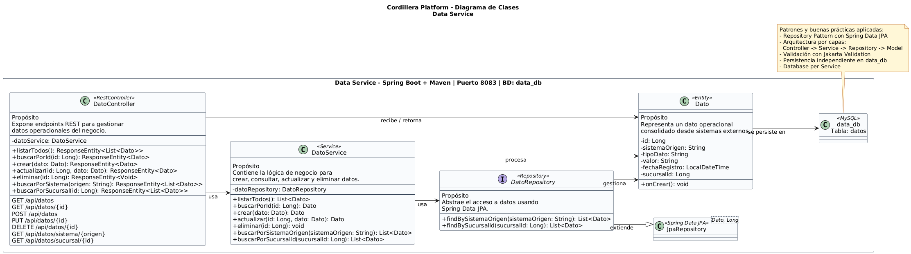
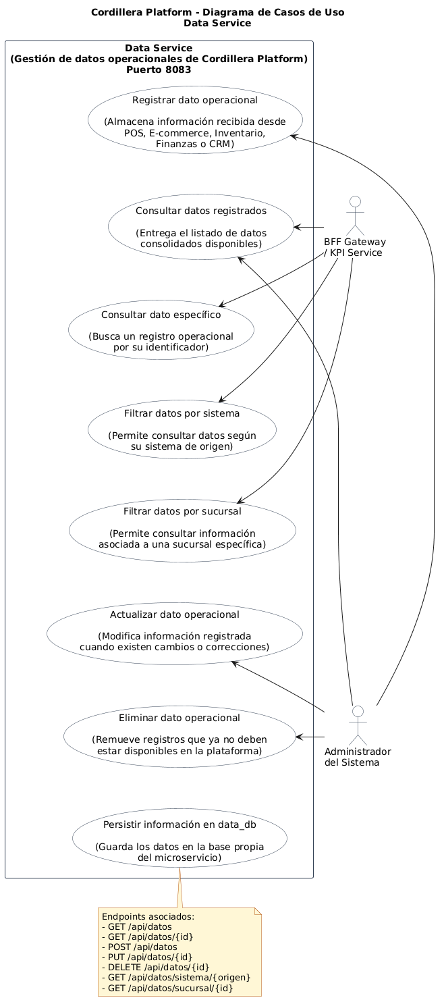

# Data Service - Cordillera Platform

Microservicio responsable de gestionar los datos operacionales consolidados de Cordillera Platform.

## 1. Descripción

`data-service` administra datos provenientes de sistemas internos de Grupo Cordillera, tales como POS, E-commerce, Inventario, Finanzas y CRM.

Expone endpoints REST para registrar, consultar, actualizar, eliminar y filtrar datos operacionales. También entrega información a `kpi-service` para apoyar el cálculo de indicadores ejecutivos.

## 2. Responsable

| Campo                 | Detalle                 |
| --------------------- | ----------------------- |
| Responsable principal | Benjamín Flores         |
| Componente            | Data Service            |
| Rama sugerida         | `feature/data-service`  |
| Puerto local          | `8083`                  |
| Base de datos         | `data_db`               |
| URL base local        | `http://localhost:8083` |

## 3. Rol dentro de la arquitectura

```text
BFF Gateway / KPI Service -> Data Service -> data_db
```

Data Service entrega datos operacionales al BFF Gateway y también puede ser consultado por KPI Service.

## 4. Stack utilizado

- Java 21
- Spring Boot 4.0.6
- Maven
- Spring Web
- Spring Data JPA
- MySQL 8.4
- H2 para pruebas
- Lombok
- Bean Validation
- Docker

## 5. Puerto y configuración

```properties
server.port=8083
spring.application.name=data-service

spring.datasource.url=${DATA_DB_URL:${DB_URL:jdbc:mysql://${DB_HOST:localhost}:${DB_PORT:3306}/data_db?createDatabaseIfNotExist=true&useSSL=false&serverTimezone=UTC&allowPublicKeyRetrieval=true}}
spring.datasource.username=${DB_USER:root}
spring.datasource.password=${DB_PASSWORD:}
spring.jpa.hibernate.ddl-auto=update
```

En Docker Compose, el servicio se conecta a MySQL mediante el nombre interno `mysql:3306`.

## 6. Base de datos

| Campo             | Detalle          |
| ----------------- | ---------------- |
| Motor             | MySQL 8.4        |
| Host local Docker | `localhost:3307` |
| Puerto contenedor | `3306`           |
| Base lógica       | `data_db`        |
| Tabla principal   | `datos`          |

## 7. Patrones y buenas prácticas aplicadas

| Patrón / práctica      | Aplicación                                        |
| ---------------------- | ------------------------------------------------- |
| Repository Pattern     | `DatoRepository` extiende `JpaRepository`.        |
| Database per Service   | Usa base propia `data_db`.                        |
| Arquitectura por capas | Controller -> Service -> Repository -> Model.     |
| Validación             | Valida datos operacionales antes de persistirlos. |

## 8. Clases principales

```text
DatoController
DatoService
DatoRepository
Dato
DataLoader
```

## 9. Modelo principal

Entidad `Dato`:

```text
id
sistemaOrigen
tipoDato
valor
fechaRegistro
sucursalId
```

## 10. Endpoints principales

| Método | Endpoint                      | Descripción                          |
| ------ | ----------------------------- | ------------------------------------ |
| GET    | `/api/datos`                  | Lista todos los datos operacionales. |
| POST   | `/api/datos`                  | Registra un nuevo dato operacional.  |
| GET    | `/api/datos/{id}`             | Consulta un dato por ID.             |
| PUT    | `/api/datos/{id}`             | Actualiza un dato.                   |
| DELETE | `/api/datos/{id}`             | Elimina un dato.                     |
| GET    | `/api/datos/sistema/{origen}` | Filtra datos por sistema origen.     |
| GET    | `/api/datos/sucursal/{id}`    | Filtra datos por sucursal.           |

## 11. Ejecución local

```powershell
cd .\data-service\
.\mvnw.cmd spring-boot:run
```

Para ejecución local sin Docker se requiere una base MySQL/MariaDB disponible o variables de entorno compatibles.

## 12. Ejecución con Docker Compose

Desde la raíz del proyecto:

```powershell
docker compose up -d --build data-service
```

Para levantar toda la arquitectura:

```powershell
docker compose up -d --build
```

## 13. Pruebas

```powershell
cd .\data-service\
.\mvnw.cmd clean test
```

Las pruebas usan H2 en memoria mediante `src/test/resources/application.properties`.

## 14. Pruebas manuales

```powershell
Invoke-RestMethod -Uri "http://localhost:8083/api/datos" -Method Get
Invoke-RestMethod -Uri "http://localhost:8083/api/datos/sistema/POS" -Method Get
Invoke-RestMethod -Uri "http://localhost:8083/api/datos/sucursal/1" -Method Get
```

## 15. Diagramas

### Diagrama de clases



### Diagrama de casos de uso



## 16. Historias de usuario y subtareas asociadas

| Código Jira | Tipo | Nombre | Responsable | Estado | Relación con Data Service |
|---|---|---|---|---|---|
| CORD-5 | Épica | EP-03 Data Service Cordillera Platform | Benjamín Flores | Finalizada | Define el microservicio responsable de registrar, consultar y entregar datos organizacionales desde los sistemas internos. |
| CORD-25 | Historia de usuario | HU-DATA-01 CRUD de datos organizacionales | Benjamín Flores | Finalizada | Implementa la gestión CRUD de datos mediante `Dato`, `DatoRepository`, `DatoService` y `DatoController`. |
| CORD-26 | Historia de usuario | HU-DATA-02 Filtros por sistema y sucursal | Benjamín Flores | Finalizada | Implementa filtros por sistema de origen y sucursal para que KPI Service pueda consultar datos específicos. |

### Detalle funcional de las HU principales

**CORD-25 - HU-DATA-01 CRUD de datos organizacionales**

Historia de usuario:

> Como analista quiero registrar y consultar datos organizacionales para disponer de información centralizada.

Criterios de aceptación relacionados:

- Existe entidad `Dato` con campos `id`, `sistemaOrigen`, `tipoDato`, `valor`, `fechaRegistro` y `sucursalId`.
- Existe `DatoRepository` extendiendo `JpaRepository`.
- Existe `DatoService` con lógica CRUD.
- Existe `DatoController` exponiendo endpoints `/api/datos`.
- Funcionan operaciones `GET`, `POST`, `PUT` y `DELETE`.

**CORD-26 - HU-DATA-02 Filtros por sistema y sucursal**

Historia de usuario:

> Como KPI Service quiero consultar datos por sistema o sucursal para calcular indicadores específicos.

Criterios de aceptación relacionados:

- Funciona `GET /api/datos/sistema/{origen}`.
- Funciona `GET /api/datos/sucursal/{id}`.
- `DatoRepository` implementa `findBySistemaOrigen`.
- `DatoRepository` implementa `findBySucursalId`.
- La respuesta JSON es correcta para filtros usados por KPI Service.

Estas historias permiten vincular la implementación técnica de Data Service con la planificación y seguimiento del proyecto en Jira.

## 17. Evidencias relacionadas

- Servicio operativo en `http://localhost:8083`.
- Endpoint `/api/datos` validado.
- Datos semilla cargados mediante `DataLoader` cuando la tabla está vacía.
- Persistencia independiente en `data_db`.
- Consumo interno desde KPI Service y BFF Gateway.
